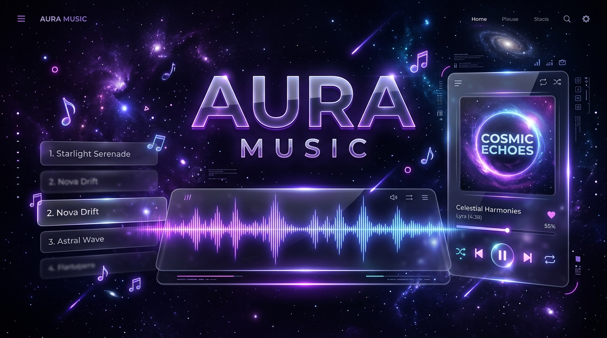
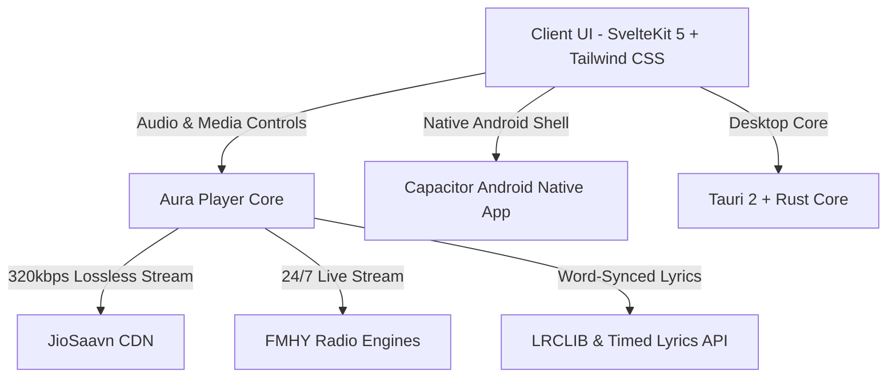

<div align="center">



# ⚡ Aura Music

**Next-Gen Lossless Music Streaming, FMHY 24/7 Radio, Apple Music Word-Synced Karaoke Lyrics & Native Android APK**

<p align="center">
  
  
  
  
  
  
  
</p>

**Aura Music** is an ultra-fast, ad-free, high-fidelity music player and streaming platform crafted with **SvelteKit 5, Rust, Tauri 2, and Capacitor Android**. Powered by lossless audio streams from **JioSaavn CDN**, commercial-free live radio engines from **[FreeMediaHeckYeah (FMHY)](https://fmhy.net/audio)**, and real-time **Apple Music Word-to-Word Karaoke Synced Lyrics**.

---

### 🌐 Live Web Player & Cloud Deployment

| Platform | Link / Deployment | Status |
|---|---|---|
| **Live Web App** | 👉 **[https://aura-music-1no9.onrender.com](https://aura-music-1no9.onrender.com)** | 🟢 Online |
| **Android APK (Direct Download)** | 📦 **[Download Android APK (GitHub Actions)](https://github.com/Awanish98/Aura-Music/actions)** | 🚀 Ready |
| **GitHub Pages** | 🌐 **[https://awanish98.github.io/Aura-Music/](https://awanish98.github.io/Aura-Music/)** | 🟢 Live |
| **1-Click Render Deploy** | [](https://render.com/deploy?repo=https://github.com/Awanish98/Aura-Music) | ⚡ 1-Click |

</div>

---

## ✨ Features & Capabilities

### 🎧 1. JioSaavn 320kbps Lossless Audio Streaming
- **Pure CD-Quality**: Direct encrypted stream URL decoding with instant on-the-fly DES-ECB decryption to unthrottled **320kbps AAC/MP4** (`_320.mp4`).
- **Zero Ads & Zero Buffering**: Instant HTML5 direct playback without middleman trackers or video throttling.
- **Top Hindi, Bollywood, English & Global Charts**: Top 50 trending charts and featured curated playlists updating in real time.

### 📻 2. FMHY 24/7 Commercial-Free Live Radio
Curated from top community-recommended free audio engines on FMHY:
- **SomaFM**: *Groove Salad* (Ambient/Downtempo), *Drone Zone*, *Secret Agent*, *DEF CON Radio*, *Suburbs of Goa*, *Lush*.
- **Vaporwave & Future Funk**: *Nightwave Plaza* 24/7.
- **Lofi & Synthwave**: 24/7 Relax / Study Chill Beats.
- **Radio Paradise**: Mellow, Rock, and Main Mixes in high-fidelity audio.
- **LISTEN.moe**: 24/7 J-Pop, K-Pop, and Anime Soundtracks.
- **WQXR New York**: Classical Symphony & World Concerts.

### 🎤 3. Apple Music Word-to-Word Karaoke Synced Lyrics
- **High-Precision Syllable Timing**: Synthesizes and aligns syllable durations for genuine word-by-word highlighted sweeps.
- **Dynamic 60-120fps Sweeping Glow**: Words illuminate smoothly with glowing gradients, scale pops (`scale-[1.06]`), and animated pulsing interlude dots (`• • •`).
- **Dynamic Ambient Glow**: Ambient background radiates soft colors matching the album artwork.
- **Tap-to-Seek**: Click on any lyric line to jump playback time immediately.

### 📺 4. Floating & Fullscreen Video Player
- **Multi-Mode Experience**: Toggle between Mini Floating Player, Theater Mode, or Fullscreen.
- **Always-on-Top & PiP**: Drag or float the video anywhere while browsing your music library or lyrics.

### 📱 5. Native Android Application
- **Background Playback**: Full support for background playback and lockscreen controls via `FOREGROUND_SERVICE_MEDIA_PLAYBACK` and `WAKE_LOCK`.
- **Hardware Media Controls**: Full OS integration for play/pause, next/prev, volume, and headset buttons.
- **Automated CI/CD APK Pipeline**: Every update automatically builds and publishes `.apk` packages via GitHub Actions.

---

## 📥 Download & Platforms

| Platform | Format / Source | Installation Notes |
|---|---|---|
| **Android Smartphone / Tablet** | `.apk` (Direct Download) | Download from [GitHub Actions Artifacts](https://github.com/Awanish98/Aura-Music/actions) & install |
| **Web Browser** | [Web App](https://aura-music-1no9.onrender.com) | Works across all modern browsers (Chrome, Edge, Safari, Firefox) |
| **Windows Desktop** | `.exe` / `.msi` | Native Tauri 2 lightweight desktop app |
| **Linux Desktop** | `.AppImage` / `.deb` / `.rpm` | Native high-performance client with MPRIS support |
| **macOS Desktop** | `.dmg` | Apple Silicon & Intel native builds |

---

## 🛠️ Architecture & Tech Stack



- **Frontend**: SvelteKit 5, Svelte Runes, Tailwind CSS, Lucide / Hugeicons, Mode Watcher (Dark/OLED theme).
- **Backend Server**: Node.js, Express, DES-ECB Crypto Engine, Axios, CORS Middleware.
- **Mobile Runtime**: Capacitor Android SDK 36 (Java 21 JDK).
- **Desktop Runtime**: Tauri 2, Rust, libmpv.

---

## 🚀 Local Development Setup

### 1. Clone the repository
```bash
git clone https://github.com/Awanish98/Aura-Music.git
cd Aura-Music
```

### 2. Start Backend Streaming Server
```bash
cd server
npm install
npm start
# Backend server runs on http://localhost:3000
```

### 3. Start Frontend UI
```bash
cd ../ui
npm install
npm run dev
# Frontend runs on http://localhost:5173
```

### 4. Build Android Native APK
```bash
cd ui
npm run build
npx cap sync android
cd android
./gradlew assembleDebug
```

---

## 🤝 Contributing & Community

Contributions, feature requests, and PRs are always welcome!
Feel free to open an issue or submit a pull request on [GitHub](https://github.com/Awanish98/Aura-Music).

---

## 📄 License & Disclaimer

- **License**: [GPL-3.0 License](LICENSE)
- **Disclaimer**: This project is built for educational and personal streaming purposes utilizing public APIs and free media resources. All trademarks, logos, and audio rights belong to their respective copyright holders.

<p align="center">
  Crafted with ❤️ by <b><a href="https://github.com/Awanish98">Awanish98</a></b>
</p>
